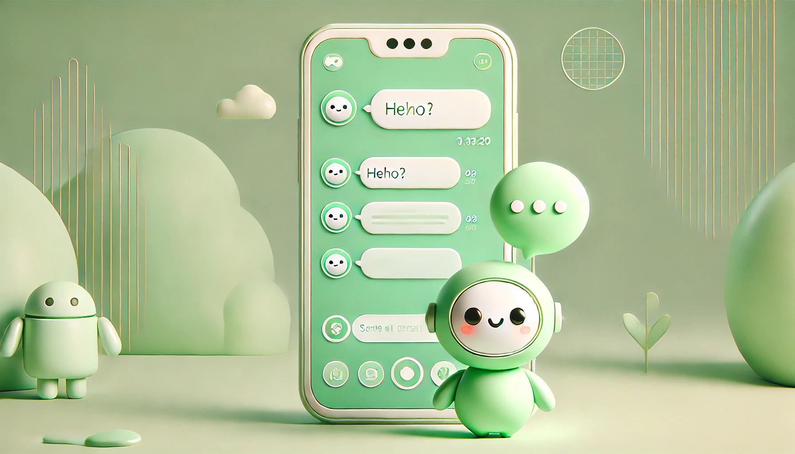

## Summary

This Python chatbot prototype automates WeChat message handling and generates responses through the OpenAI API. The project demonstrates integration between desktop automation, conversation state management, and large language model services.

## Scope

- Retrieve and process WeChat messages with `wxauto`.
- Maintain conversation context for more coherent responses.
- Run message handling in a background process.
- Log activity for debugging and review.

## Implementation

The prototype is designed for PC WeChat version 3.9.11.17. Core tools include Python, OpenAI API, `wxauto`, threading, and logging.

**Repository:** [ChatBot_WeChat](https://github.com/ZY-ZHOU23/ChatBot_WeChat)
