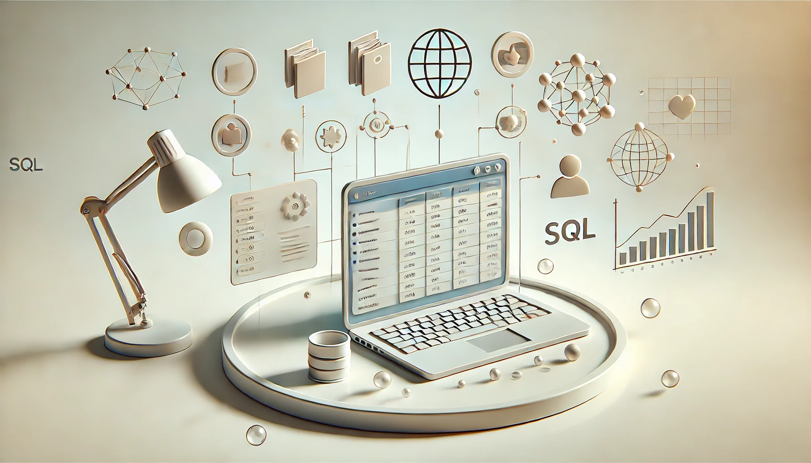

## Summary

This full-stack application organizes personal records across areas such as health, finance, habits, and goals. It combines structured storage, analysis, and automation in a single workflow for personal data management.

## Scope

- Record memos, metrics, categories, tags, and user information through a REST API.
- Support metric tracking and dashboard-based review of personal trends.
- Provide authentication, backups, audit logs, and deployable infrastructure.

## Implementation

- **Backend:** FastAPI, SQLAlchemy, Alembic, Redis, MySQL.
- **Frontend:** React, TypeScript, Chart.js, Axios, Material UI, Tailwind CSS.
- **Analysis and automation:** Python, Pandas, Matplotlib, Seaborn, Docker.

## Deliverables

- API documentation through Swagger UI.
- Configurable dashboard for memo entry, browsing, and metric visualization.
- Python analysis tools for summaries, plots, and trend review.

**Repository:** [MemoTrack-SQL](https://github.com/ZY-ZHOU23/MemoTrack-SQL)
