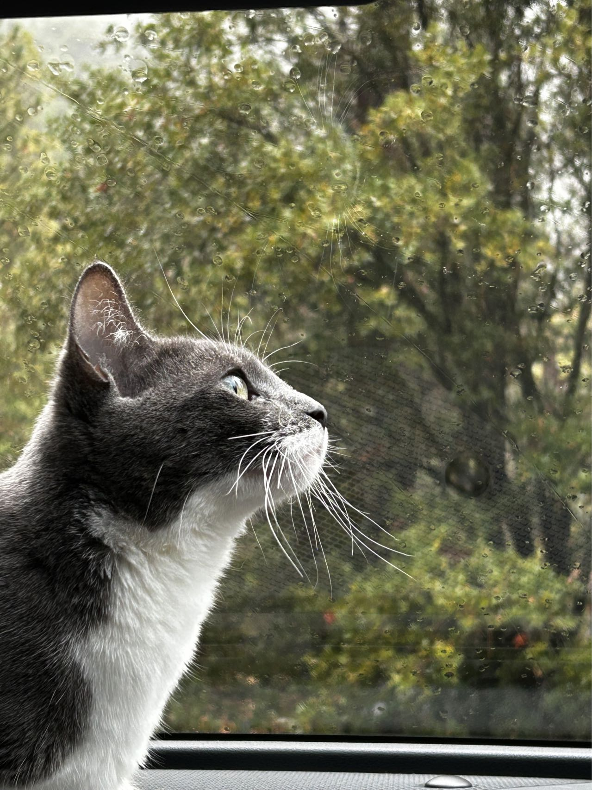
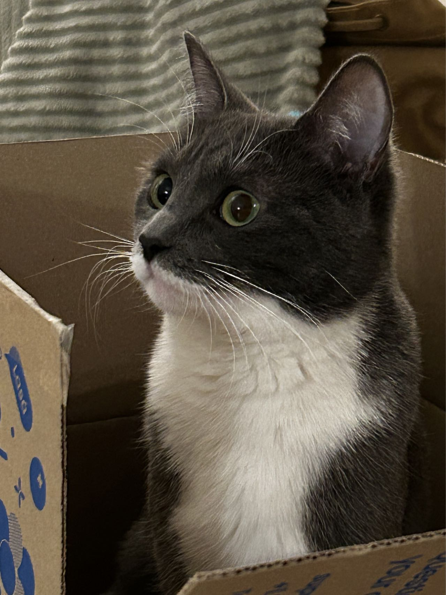
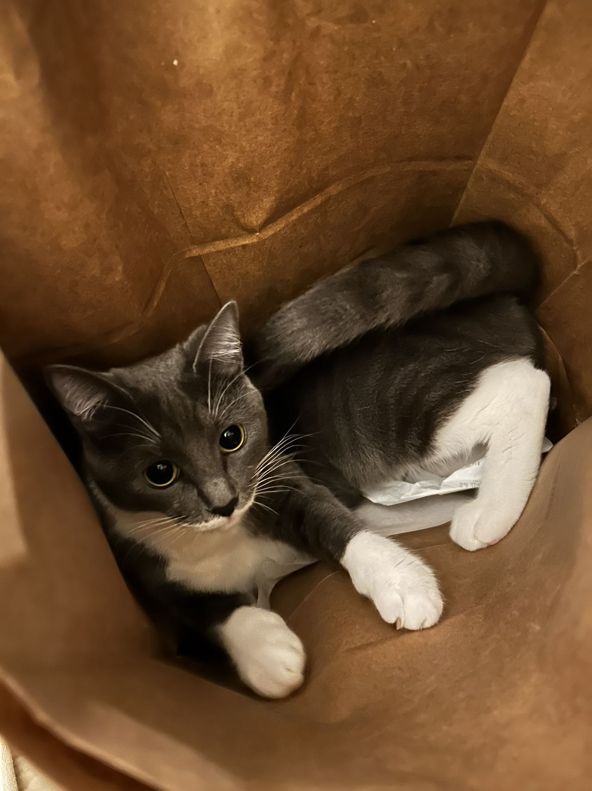

:::: {.column-page}

## About Me

I recently graduated from UCLA with degrees in Economics and Statistics & Data Science, and I'm currently pursuing my Master of Public Policy at the University of Chicago.

My work mainly focuses on statistical modeling, data engineering, applied machine learning, and decision support systems. 


---

:::: {.columns}
:::: {.column width="50%"}

## Bonnie~

```{=html}
<div class="carousel-container">
  <div id="bonniephoto" class="carousel slide" data-bs-ride="carousel">
    <div class="carousel-inner">
      <div class="carousel-item active">
        
      </div>
      <div class="carousel-item">
        
      </div>
      <div class="carousel-item">
        
      </div>
      <div class="carousel-item">
        
      </div>
    </div>
    <button class="carousel-control-prev" type="button" data-bs-target="#bonniephoto" data-bs-slide="prev">
      <span class="carousel-control-prev-icon" aria-hidden="true"></span>
      <span class="visually-hidden">Previous</span>
    </button>
    <button class="carousel-control-next" type="button" data-bs-target="#bonniephoto" data-bs-slide="next">
      <span class="carousel-control-next-icon" aria-hidden="true"></span>
      <span class="visually-hidden">Next</span>
    </button>
  </div>
</div>
```

::::
:::: {.column width="50%"}

## MerMer~

```{=html}
<div class="carousel-container">
  <div id="mermerphoto" class="carousel slide" data-bs-ride="carousel">
    <div class="carousel-inner">
      <div class="carousel-item active">
        
      </div>
      <div class="carousel-item">
        
      </div>
      <div class="carousel-item">
        
      </div>
      <div class="carousel-item">
        
      </div>
      <div class="carousel-item">
        
      </div>
      <div class="carousel-item">
        
      </div>
      <div class="carousel-item">
        
      </div>
      <div class="carousel-item">
        
      </div>
    </div>
    <button class="carousel-control-prev" type="button" data-bs-target="#mermerphoto" data-bs-slide="prev">
      <span class="carousel-control-prev-icon" aria-hidden="true"></span>
      <span class="visually-hidden">Previous</span>
    </button>
    <button class="carousel-control-next" type="button" data-bs-target="#mermerphoto" data-bs-slide="next">
      <span class="carousel-control-next-icon" aria-hidden="true"></span>
      <span class="visually-hidden">Next</span>
    </button>
  </div>
</div>
```

::::
::::

::::
